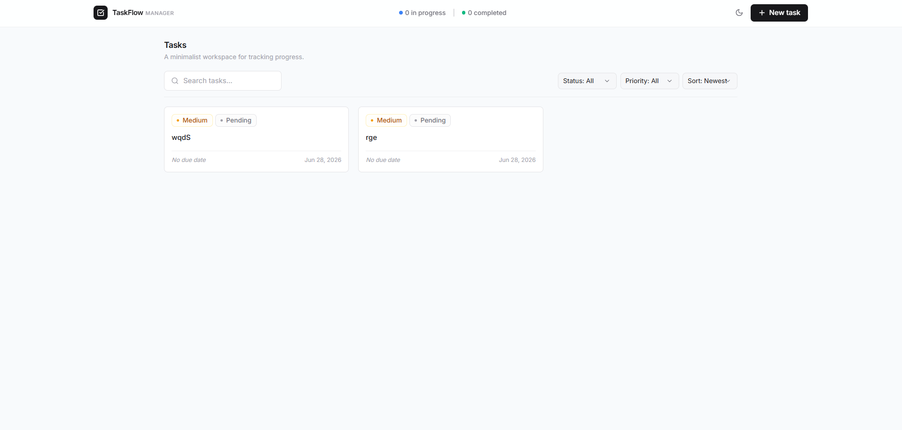
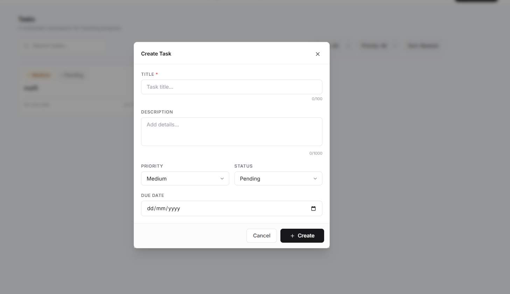

# 🚀 TaskFlow

A modern full-stack task management application built with the **MERN Stack** that helps users create, organize, and track tasks efficiently through a clean, responsive interface.

TaskFlow focuses on simplicity, speed, and productivity while showcasing production-ready full-stack development practices.

---

## 🌐 Live Demo

**Frontend:** [task-tracker-mern-fawn.vercel.app](https://task-tracker-mern-fawn.vercel.app/)

**Backend API:** [task-tracker-mern-a0qd.onrender.com](https://task-tracker-mern-a0qd.onrender.com)

---

## 📸 Preview

### Dashboard



### Create Task



---

# ✨ Features

## Task Management

- Create new tasks
- Edit existing tasks
- Delete tasks with confirmation
- Update task status
- Set task priority
- Add optional descriptions
- Due date support

---

## Search & Filtering

- Instant task search
- Filter by status
- Filter by priority
- Sort by:
  - Latest
  - Oldest
  - Due Date

---

## User Experience

- Responsive design
- Dark / Light mode
- Smooth animations
- Toast notifications
- Loading states
- Empty state illustrations
- Real-time UI updates
- Data persists after refresh

---

## Security & Validation

- Client-side validation
- Server-side validation
- MongoDB schema validation
- Helmet security headers
- Express Rate Limiting
- Error handling middleware

---

# 🛠 Tech Stack

## Frontend

- React
- Vite
- Tailwind CSS
- Axios
- React Hot Toast
- Lucide React Icons

## Backend

- Node.js
- Express.js
- MongoDB Atlas
- Mongoose
- Helmet
- Express Rate Limit
- dotenv
- CORS

## Deployment

- Vercel
- Render
- MongoDB Atlas

---

# 📁 Project Structure

```
TaskFlow
│
├── client/
│   ├── src/
│   │   ├── components/
│   │   ├── pages/
│   │   ├── hooks/
│   │   ├── services/
│   │   ├── context/
│   │   └── utils/
│   │
│   └── public/
│
├── server/
│   ├── config/
│   ├── controllers/
│   ├── middleware/
│   ├── models/
│   ├── routes/
│   └── server.js
│
└── README.md
```

---

# 🚀 Getting Started

## Clone the repository

```bash
git clone https://github.com/harsh-dsk/taskflow.git

cd taskflow
```

---

## Backend Setup

```bash
cd server

npm install
```

Create a `.env`

```env
PORT=5000

NODE_ENV=development

MONGO_URI=your_mongodb_connection_string

CLIENT_ORIGIN=http://localhost:5173
```

Run the backend

```bash
npm run dev
```

---

## Frontend Setup

```bash
cd client

npm install
```

Create a `.env`

```env
VITE_API_URL=http://localhost:5000
```

Run the frontend

```bash
npm run dev
```

Open

```
http://localhost:5173
```

---

# 📡 API Endpoints

## Get All Tasks

```
GET /api/tasks
```

Supports

```
search

status

priority

sort
```

---

## Create Task

```
POST /api/tasks
```

Example

```json
{
  "title": "Complete README",
  "description": "Finish project documentation",
  "priority": "High",
  "status": "Pending",
  "dueDate": "2026-07-01"
}
```

---

## Update Task

```
PUT /api/tasks/:id
```

---

## Delete Task

```
DELETE /api/tasks/:id
```

---

# 🌍 Deployment

### Frontend

Deploy on **Vercel**

### Backend

Deploy on **Render**

### Database

Use **MongoDB Atlas**

---

# 🚧 Future Improvements

- User Authentication
- Multiple Workspaces
- Drag & Drop Kanban Board
- Calendar View
- Task Labels & Tags
- Email Reminders
- File Attachments
- Team Collaboration
- Activity Timeline

---

# 📚 What I Learned

This project helped strengthen my understanding of:

- REST API development
- Express.js architecture
- MongoDB & Mongoose
- React Hooks
- Context API
- CRUD Operations
- State Management
- API Integration
- Full-stack deployment
- Environment variable management
- Building production-ready applications

---

# 🤝 Contributing

Contributions, issues, and feature requests are welcome.

Feel free to fork the repository and submit a Pull Request.

---

# ⭐ Support

If you found this project useful, consider giving it a ⭐ on GitHub.

It helps others discover the project and motivates future improvements.

---

# 👨‍💻 Author

### Harshdeep Singh Khanuja

🎓 B.Tech Electronics & Telecommunication — SGSITS Indore

**GitHub**

https://github.com/harsh-dsk

**LinkedIn**

https://linkedin.com/in/harshdeep-singh-khanuja

---

## 📄 License

This project is licensed under the MIT Licens

# TaskFlow — Full-Stack MERN Task Manager


A production-ready, full-stack task management application built with the **MERN stack**. Create, organise, and track your tasks with a polished, responsive UI that supports dark mode, real-time filtering, and smooth animations.

---

## ✨ Features

- **Full CRUD** — Create, read, update, and delete tasks
- **Search** — Debounced full-text search across title and description
- **Filter** — Filter by status (Pending / In Progress / Completed) and priority (Low / Medium / High)
- **Sort** — Sort by Latest, Oldest, or Due Date
- **Validation** — Client-side and server-side validation with inline error messages
- **Dark Mode** — System-preference aware, persisted to `localStorage`
- **Responsive** — Mobile-first layout that works on all screen sizes
- **Toast Notifications** — Success/error feedback after every operation
- **Loading & Empty States** — Dedicated states for loading, errors, and empty results
- **Accessibility** — ARIA labels, keyboard navigation, focus traps in modals
- **Security** — Helmet, rate limiting, input sanitisation on the backend

---

## 🛠 Tech Stack

### Frontend

| Technology        | Purpose                   |
| ----------------- | ------------------------- |
| React 19 + Vite 8 | UI framework + build tool |
| Tailwind CSS 3    | Utility-first styling     |
| Axios             | HTTP client               |
| React Hot Toast   | Toast notifications       |
| Lucide React      | Icon set                  |

### Backend

| Technology         | Purpose                      |
| ------------------ | ---------------------------- |
| Node.js + Express  | REST API server              |
| MongoDB Atlas      | Cloud database               |
| Mongoose           | ODM / schema validation      |
| Helmet             | HTTP security headers        |
| express-rate-limit | API rate limiting            |
| dotenv             | Environment variable loading |

---

## 📁 Folder Structure

```
taskflow/
├── client/                   # React (Vite) frontend
│   ├── public/               # Static assets (favicon, icons)
│   ├── src/
│   │   ├── components/
│   │   │   ├── DeleteModal.jsx
│   │   │   ├── EmptyState.jsx
│   │   │   ├── FilterBar.jsx
│   │   │   ├── LoadingSpinner.jsx
│   │   │   ├── Navbar.jsx
│   │   │   ├── SearchBar.jsx
│   │   │   ├── TaskCard.jsx
│   │   │   ├── TaskForm.jsx
│   │   │   └── TaskList.jsx
│   │   ├── context/
│   │   │   └── TaskContext.jsx   # Global state (useReducer)
│   │   ├── hooks/
│   │   │   └── useTasks.js       # Filter-aware fetch hook
│   │   ├── pages/
│   │   │   └── Home.jsx          # Dashboard page
│   │   ├── services/
│   │   │   └── taskService.js    # Axios instance + API calls
│   │   ├── utils/
│   │   │   └── helpers.js        # Date / badge utilities
│   │   ├── App.jsx
│   │   ├── index.css
│   │   └── main.jsx
│   ├── .env.example
│   ├── vercel.json               # Vercel SPA routing
│   ├── tailwind.config.js
│   └── vite.config.js
│
├── server/                   # Express backend
│   ├── config/
│   │   └── db.js             # MongoDB connection
│   ├── controllers/
│   │   └── taskController.js # CRUD handlers
│   ├── middleware/
│   │   └── errorHandler.js   # Global error handler
│   ├── models/
│   │   └── Task.js           # Mongoose schema
│   ├── routes/
│   │   └── taskRoutes.js     # Express router
│   ├── .env.example
│   └── server.js             # Entry point
│
├── render.yaml               # Render deployment blueprint
├── .gitignore
├── package.json              # Root workspace scripts
└── README.md
```

---

## 🚀 Getting Started

### Prerequisites

- Node.js v18 or higher
- A [MongoDB Atlas](https://www.mongodb.com/atlas) account (free tier works)

### 1. Clone the repository

```bash
git clone https://github.com/harsh-dsk/task-tracker-mern.git
cd task-tracker-mern
```

### 2. Configure the backend

```bash
cd server
cp .env.example .env
```

Open `server/.env` and fill in your values:

```env
PORT=5000
NODE_ENV=development
MONGO_URI=mongodb+srv://<username>:<password>@cluster0.xxxxx.mongodb.net/taskflow?retryWrites=true&w=majority
CLIENT_ORIGIN=http://localhost:5173
```

### 3. Configure the frontend

```bash
cd client
cp .env.example .env
```

Open `client/.env`:

```env
VITE_API_URL=http://localhost:5000/api
```

### 4. Install dependencies and run

**Option A — Root scripts (recommended)**

```bash
npm run install:all      # installs both server and client deps
npm run dev:server       # Terminal 1 — starts Express on :5000
npm run dev:client       # Terminal 2 — starts Vite on :5173
```

**Option B — Manually**

```bash
# Terminal 1
cd server && npm install && npm run dev

# Terminal 2
cd client && npm install && npm run dev
```

Open **http://localhost:5173** in your browser.

---

## 🔑 Environment Variables

### Backend (`server/.env`)

| Variable        | Required | Description                                |
| --------------- | -------- | ------------------------------------------ |
| `PORT`          | No       | Server port (default:`5000`)               |
| `NODE_ENV`      | No       | `development` or `production`              |
| `MONGO_URI`     | **Yes**  | Full MongoDB Atlas connection string       |
| `CLIENT_ORIGIN` | **Yes**  | Frontend URL(s) for CORS (comma-separated) |

### Frontend (`client/.env`)

| Variable       | Required | Description                                    |
| -------------- | -------- | ---------------------------------------------- |
| `VITE_API_URL` | **Yes**  | Backend base URL (e.g.`http://localhost:5000`) |

---

## 📡 API Reference

**Base URL:** `http://localhost:5000/api`

### Tasks

| Method   | Endpoint     | Description                             |
| -------- | ------------ | --------------------------------------- |
| `GET`    | `/tasks`     | Fetch all tasks (supports query params) |
| `POST`   | `/tasks`     | Create a new task                       |
| `PUT`    | `/tasks/:id` | Update a task by ID                     |
| `DELETE` | `/tasks/:id` | Delete a task by ID                     |

### GET /tasks — Query Parameters

| Param      | Type     | Description                                 |
| ---------- | -------- | ------------------------------------------- |
| `search`   | `string` | Full-text search on title/description       |
| `status`   | `string` | `Pending` or `In Progress` or `Completed`   |
| `priority` | `string` | `Low` or `Medium` or `High`                 |
| `sort`     | `string` | `latest` (default) or `oldest` or `dueDate` |

### Task Schema

```json
{
  "_id": "ObjectId",
  "title": "string (required, 3-100 chars)",
  "description": "string (optional, max 1000 chars)",
  "priority": "Low | Medium | High",
  "status": "Pending | In Progress | Completed",
  "dueDate": "ISO date string | null",
  "createdAt": "ISO date string",
  "updatedAt": "ISO date string"
}
```

---

## 🌐 Deployment

### Backend → Render

1. Push your code to GitHub.
2. Go to [render.com](https://render.com) → **New Web Service** → Connect your repo.
3. Render will auto-detect `render.yaml` and configure the service.
4. In the Render dashboard, add environment variables manually:
   - `MONGO_URI` — your Atlas connection string
   - `CLIENT_ORIGIN` — your Vercel frontend URL
5. Deploy. Your API will be live at `https://taskflow-api.onrender.com`.

### Frontend → Vercel

1. Go to [vercel.com](https://vercel.com) → **New Project** → Import your repo.
2. Set **Root Directory** to `client`.
3. Add environment variable: `VITE_API_URL` = `https://taskflow-api.onrender.com`
4. Deploy. Vercel uses `vercel.json` to handle SPA routing automatically.

### MongoDB Atlas

1. Create a free cluster at [mongodb.com/atlas](https://www.mongodb.com/atlas).
2. Create a database user (Settings → Database Access).
3. Whitelist `0.0.0.0/0` in Network Access for Render dynamic IPs.
4. Copy the connection string and set it as `MONGO_URI` in Render.

---

## 📸 Screenshots

> Add your own screenshots here after deploying.

| Dashboard (Light) | Dashboard (Dark) |
| ----------------- | ---------------- |
| _(screenshot)_    | _(screenshot)_   |

---

## 📄 License

This project is licensed under the **MIT License**.

---

## 👤 Author

Built as a portfolio project showcasing Full-Stack MERN development skills.

- **GitHub:** [@harsh-dsk](https://github.com/harsh-dsk)
- **LinkedIn:** [Harshdeep Singh Khanuja](https://linkedin.com/in/harshdeep-singh-khanuja)
